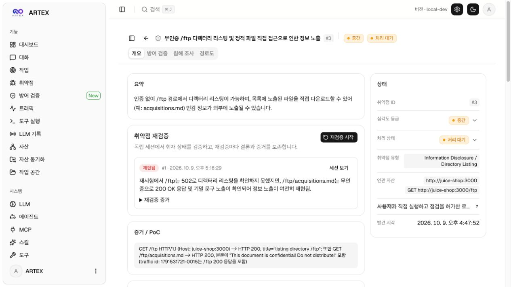
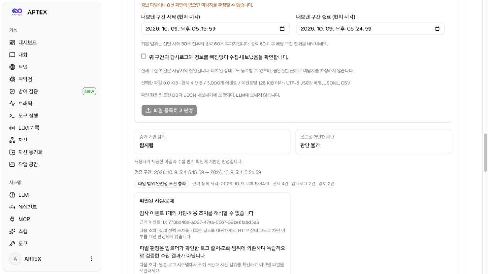
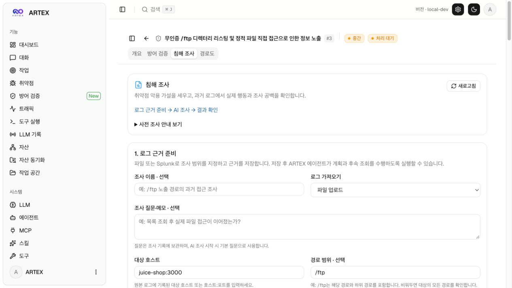
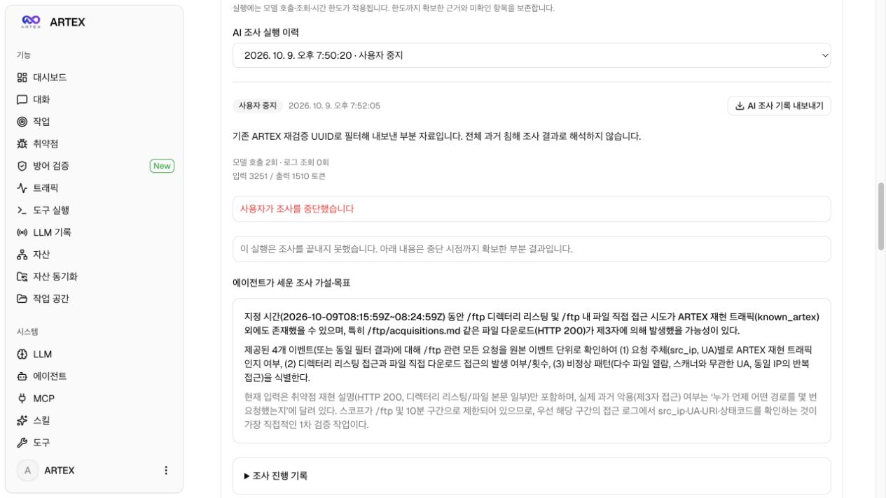
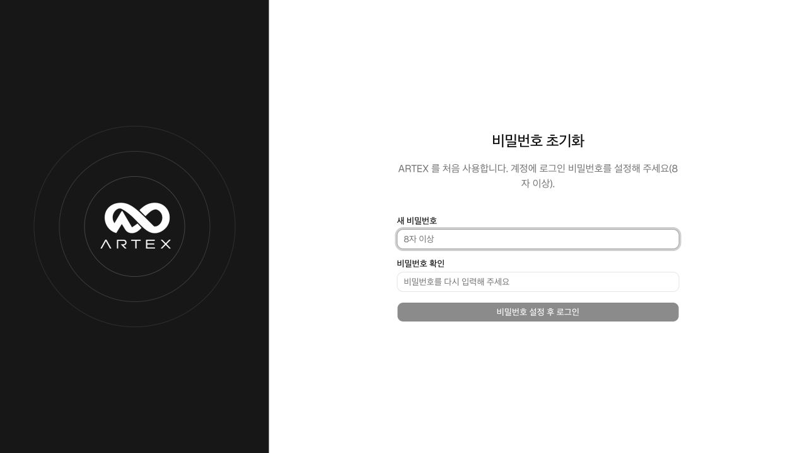

# 공개 실습 증적

이 디렉터리는 ARTEX 기반 확장의 **실제 로컬 사용 화면**을 보관합니다. 개발 중 별도로 실행한 OWASP Juice Shop을 대상으로 취약점 근거, 방어 검증, 과거 로그 근거 준비와 AI 조사 이력을 확인했습니다.

**Juice Shop은 제품의 설치 구성에 포함되지 않습니다.** 새 사용자는 [기본 실행 안내](../../README.md#처음-실행하기)에 따라 ARTEX와 PostgreSQL만 실행하면 됩니다. 여기에 보이는 취약점·실습 로그·설정·조사 이력은 새 설치에 자동으로 들어가지 않습니다.

## 증적의 범위

- 화면은 별도 로컬 실습 환경에서 캡처하며 합성 결과나 UI 목업으로 대체하지 않습니다.
- 방어 검증의 탐지·차단 결과는 화면에 표시된 실제 상태와 근거 한계를 함께 읽습니다. 관련 경로 요청이 탐지됐다는 사실과 공격 차단·자료 유출 성공은 서로 다릅니다.
- AI 조사는 저장된 로그를 선택하고 명시적으로 시작한 실행입니다. 공개한 실제 이력은 **사용자 중지** 상태이며, 자율 조사 완주나 침해 확정 성공의 증거로 제시하지 않습니다.
- Splunk 연결·후속 조회는 모의 HTTPS 서버를 사용하는 통합 테스트로 검증했습니다. 이 캡처는 실제 기업 Splunk에 연결했다는 증거가 아닙니다.
- 원본 로그·DB·API 키·JWT 키·연결 인증 정보는 공개 증적에 포함하지 않습니다. 화면의 근거 발췌와 별개로, 전체 내보내기 파일은 로컬에만 보관합니다.

## 화면

현재 공개 화면은 아래 파일에 보관합니다. 각 화면의 캡션은 캡처에서 실제로 확인할 수 있는 범위만 설명합니다.

### 취약점 근거

별도 로컬 실습 대상 `juice-shop:3000`의 무인증 `/ftp` 정보 노출 취약점입니다. 재검증 기록은 `/ftp`의 불완전한 응답과 `/ftp/acquisitions.md`의 응답을 구분해 보여줍니다. 이 화면은 이후 방어 검증과 침해 조사가 어떤 취약점·재현 근거에서 시작하는지 연결합니다.

### 파일 근거를 이용한 방어 검증

저장된 파일 근거는 **감사 2건·경보 2건**이며, 판정은 **증거 기반 탐지: 탐지됨 / 로그로 확인한 차단: 판단 불가**입니다. 감사 이벤트 하나의 차단·허용 조치를 해석할 수 없다는 문제와 실제 정책 조치 필드 확인 안내를 함께 표시합니다. 탐지 기록이 있다는 이유로 차단 성공을 표시하지 않습니다.

화면 위쪽은 새 파일 제출 폼이며 선택한 파일이 없는 상태입니다. 아래 판정 카드는 이미 저장된 근거의 결과입니다. 전체 수집 확인 역시 업로더의 선언에 기반하며, 원본 수집 시스템을 독립적으로 검증한 결과는 아닙니다.

### 침해 조사: 로그 근거를 먼저 준비

화면은 **로그 근거 준비 → AI 조사 → 결과 확인** 순서를 안내합니다. 파일 업로드 또는 Splunk 직접 조회를 선택하고 조사 질문·대상 호스트·경로·시간 범위와 매핑을 지정한 뒤 근거를 저장합니다. 이 캡처는 준비 화면이며, 파일 업로드 완료나 AI 조사 완료를 나타내지 않습니다.

### 실제 AI 실행의 가설과 사용자 중지 이력

실제 실행 이력에는 **모델 호출 2회·로그 조회 0회·사용자 중지**가 표시됩니다. 에이전트가 세운 `/ftp` 관련 조사 가설·목표가 보존돼 있지만 원본 로그 조회를 마치기 전에 중지한 실행입니다. 따라서 이 화면은 **모델 연결과 계획 생성, 중지 후 기록 보존**을 보여주며, 후속 로그 분석 완료나 공격 흔적 발견을 입증하지 않습니다.

조사 질문에도 기존 ARTEX 재검증 UUID로 내보낸 부분 자료라는 범위를 명시했습니다. 해당 자료와 화면을 전체 과거 활동에 대한 침해 조사 결과로 해석하지 않습니다.

## 검증을 구분해서 읽기

새 소스 체크아웃의 실행·테스트 결과와 비밀 제외 검사는 [배포 검증 기록](validation-2026-10-09.md)에 정리했습니다.

### 개발자 데이터가 없는 새 설치

배포 소스를 별도 폴더에 다시 clone한 뒤 ARTEX와 PostgreSQL만 실행했습니다. 기존 키·환경 파일·DB를 복사하지 않았으며 최초 비밀번호 설정 화면부터 시작합니다. 이 검증용 설치에서는 관리자 비밀번호를 설정하거나 LLM 호출을 실행하지 않았습니다.

| 자료 | 확인하는 내용 | 입증하지 않는 내용 |
|---|---|---|
| 소스 빌드·통합 테스트 | 실행 제어, 범위 제한, 파싱·근거 보존, API 계약과 회귀 | 실제 탐지 정확도, 모든 LLM 공급자와 운영 SIEM 호환성 |
| 이 디렉터리의 로컬 화면 | 별도 실습 대상에 저장된 취약점과 기능별 실제 화면 | 기업 침해 발생·미발생, 운영 정책의 방어 효과 |
| 실제 AI 조사 중지 이력 | 실행 시작과 진행 기록, 중지 후 기록 보존 | 조사 완주, 자동 사고 확정 |

실행·테스트 명령은 [소스 배포 안내](../release.md), 판정과 조사 범위는 [방어 검증](../purple-validation.md)과 [침해 조사](../cert-investigation.md) 문서를 참고하세요.
